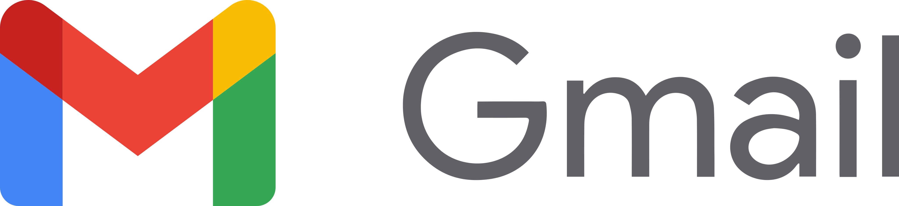

<h1 align="center">
    
</h1>

## 💻 Project summary

Reading emails from Gmail provider using Node.js along with Google API (study only).

## 🛠 Technologies

Project was built using **Node.js** and the following dependencies:

- **[Axios](https://www.npmjs.com/package/axios)** - It is an HTTP client based on Promises for making requests. It can be used on both the front-end and the back-end.

- **[Dotenv](https://www.npmjs.com/package/dotenv)** - Is a zero-dependency module that loads environment variables

- **[qs](https://www.npmjs.com/package/qs)** - A querystring parsing and stringifying library with some added security.

## 🔨 Local Installation

You need **[Node.js](https://nodejs.org)** version 10 or higher, but if you want to use **[Yarn](https://yarnpkg.com/)** you can also just have it on your computer to continue.

```bash
git clone https://github.com/jhonywalkeer/reading-gmail.git

$ cd reading-gmail
$ npm install or yarn install
```

And now to buil our project just run the following command:

```bash
$ cd reading-gmail
$ npm dev or yarn dev
```

Answer will be displayed on the terminal

## 📖 License

This project is under license from MIT. See the [LICENSE](LICENSE.md) file for more details.
